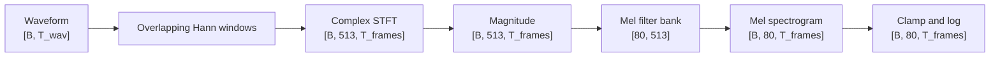
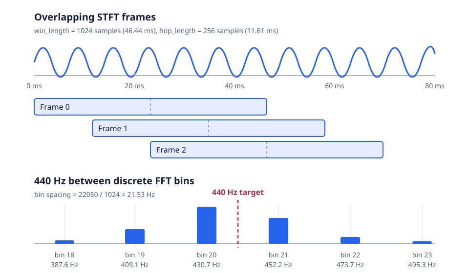

# STFT and Mel Features for VITS2

This chapter converts the controlled `440 Hz` waveform from Chapter 02 into the time-frequency representation used by the VITS2 acoustic path.

The goal is not merely to call a library transform. The goal is to predict every important shape, understand what each parameter changes, verify the physical frequency represented by the output, and then construct the mel projection in understandable stages.

## Learning objectives

By the end of this chapter, you should be able to explain and verify:

- Why one FFT over an utterance loses timing information.
- How window length, hop length, overlap, and centering create STFT frames.
- Why a Hann window reduces boundary artifacts.
- Why the STFT is complex-valued.
- How complex values become magnitude values.
- How FFT-bin indices map to frequencies in Hz.
- Why a `440 Hz` tone appears near bins `20` and `21`.
- How a mel filter bank maps `513` linear-frequency bins to `80` mel bins.
- Why logarithmic compression is applied.
- How waveform lengths become spectrogram lengths and masks.

## Prerequisite

Complete [Chapter 02](../02-digital-audio-foundations/README.md) first. Its experiment produces a known signal with these invariants:

```text
frequency:  440 Hz
duration:   1 second
shape:      [1, 22050]
dtype:      float32
amplitude:  between -1 and +1
```

A known tone gives this chapter a ground-truth question:

> Does the spectral analysis place its strongest energy near 440 Hz?

## 1. From waveform to log-mel features

The complete feature pipeline is:

```text
waveform [B, T_wav]
    -> overlapping short windows
windowed frames
    -> FFT per frame
complex STFT [B, F, T_frames]
    -> magnitude
magnitude spectrogram [B, F, T_frames]
    -> mel filter bank
mel spectrogram [B, n_mels, T_frames]
    -> clamp and logarithm
log-mel spectrogram [B, n_mels, T_frames]
```

For this project:

```text
B         = batch size
F         = n_fft // 2 + 1 = 513
n_mels    = 80
T_wav     = waveform samples
T_frames  = STFT time frames
```

## Visual overview



The following diagram connects the two central ideas:

- Overlapping windows preserve approximate timing.
- A continuous frequency such as `440 Hz` falls between discrete FFT-bin centers.



In the lower plot, bin `20` has the largest illustrated magnitude because its center (`430.66 Hz`) is closer to `440 Hz` than bin `21` (`452.20 Hz`). Neighboring bars remain nonzero because the tone lies between bins and its energy leaks across the finite FFT grid.

## 2. Why use an STFT?

A single FFT over an entire utterance answers:

> Which frequencies occur somewhere in this signal?

It does not clearly answer:

> When does each frequency occur?

For example, compare:

```text
Recording A: 440 Hz first, then 880 Hz
Recording B: 440 Hz and 880 Hz together throughout
```

A whole-signal FFT may show both frequencies for both recordings. The STFT retains approximate timing by analyzing many short, overlapping sections:

```text
waveform
??? frame 0 -> frequency analysis
??? frame 1 -> frequency analysis
??? frame 2 -> frequency analysis
??? ...
```

The resulting spectrogram is a sequence of local frequency analyses.

## 3. Analysis configuration

Use the same values as the reference VITS2 configuration:

```text
sample_rate = 22050
n_fft       = 1024
win_length  = 1024
hop_length  = 256
n_mels      = 80
f_min       = 0 Hz
f_max       = 8000 Hz
center      = True
power       = 1.0
```

### Parameter meanings

| Parameter | Meaning | Main dimension affected |
|---|---|---|
| `sample_rate` | Measurements per second | Physical interpretation of time and frequency |
| `n_fft` | Fourier-transform size | Number and spacing of frequency bins |
| `win_length` | Samples weighted by the analysis window | Time-frequency trade-off |
| `hop_length` | Samples between consecutive frame starts | Number and spacing of time frames |
| `n_mels` | Number of perceptual frequency bands | Mel-frequency dimension |
| `f_min`, `f_max` | Frequency range represented by mel filters | Mel coverage |
| `center` | Whether frames are centered using boundary padding | Frame count and edge behavior |

## 4. Window duration, hop duration, and overlap

### Window duration

```text
window_duration = win_length / sample_rate
                = 1024 / 22050
                = approximately 0.04644 seconds
                = approximately 46.44 ms
```

Each frame examines about `46.44 ms` of audio.

### Hop duration

```text
hop_duration = hop_length / sample_rate
             = 256 / 22050
             = approximately 0.01161 seconds
             = approximately 11.61 ms
```

A new frame begins about every `11.61 ms`.

### Overlap

```text
overlap_samples = win_length - hop_length
                = 1024 - 256
                = 768 samples

overlap_fraction = 768 / 1024
                 = 0.75
                 = 75 percent
```

A longer window improves frequency discrimination but mixes information across a longer time span. A shorter hop provides denser timing information but creates more frames and more computation.

## 5. Frame count and centering

For a frame size of `n_fft`, the general count is:

```text
frames = 1 + floor((signal_length + 2 * padding - n_fft) / hop_length)
```

With `center=True`, PyTorch pads approximately `n_fft // 2` samples on each side:

```text
padding = n_fft // 2 = 512
```

For a one-second waveform:

```text
signal_length = 22050

frames = 1 + floor((22050 + 2*512 - 1024) / 256)
       = 1 + floor(22050 / 256)
       = 87
```

Therefore, the expected STFT shape is:

```text
[1, 513, 87]
```

Important: `center=True` changes boundary behavior and frame count. Never calculate spectrogram lengths with `waveform_length // hop_length` without checking the transform's padding convention.

## 6. Why use a Hann window?

Abruptly cutting a waveform into frames can create discontinuities at frame boundaries. The FFT interprets these artificial jumps as additional frequency content.

A Hann window smoothly weights a frame:

```text
frame edges  -> weights near 0
frame center -> weights near 1
```

This reduces spectral leakage caused by hard frame boundaries. The trade-off is that a frequency peak becomes slightly wider. Overlapping windows ensure information suppressed near one frame's edges is represented near the center of neighboring frames.

The Hann window must match the waveform's:

- Device
- Floating-point dtype
- Configured `win_length`

## 7. Complex STFT values

For each frequency bin and time frame, the FFT returns a complex number:

```text
z = real + imaginary * j
```

This representation contains:

- Magnitude: the component's strength.
- Phase: its position within the oscillation cycle.

The magnitude is:

```text
|z| = sqrt(real^2 + imaginary^2)
```

Example:

```text
z = 3 + 4j
|z| = 5
```

Taking magnitude changes the dtype but not the shape:

```text
complex STFT: [B, F, T_frames], complex64
magnitude:    [B, F, T_frames], float32
```

All magnitude values must be nonnegative.

The reference feature extractor uses `power=1.0`, so it works with magnitude. A power spectrogram would square the magnitude and has different numerical scaling.

## 8. Frequency bins

For real-valued audio, negative-frequency FFT components mirror positive-frequency components. Only the nonnegative side is retained:

```text
frequency_bins = n_fft // 2 + 1
               = 1024 // 2 + 1
               = 513
```

The bins run from:

```text
bin 0   -> 0 Hz, also called DC
bin 512 -> sample_rate / 2 = 11025 Hz, the Nyquist frequency
```

### Bin spacing

```text
bin_spacing = sample_rate / n_fft
            = 22050 / 1024
            = approximately 21.5332 Hz
```

Bin `k` represents:

```text
bin_frequency = k * bin_spacing
```

This works because bin `k` represents a sinusoidal pattern completing `k` cycles inside the FFT frame.

## 9. Locating the 440 Hz tone

The tone's fractional bin location is:

```text
fractional_bin = tone_frequency / bin_spacing
               = 440 / 21.5332
               = approximately 20.43
```

The tone lies between bins `20` and `21`:

```text
bin 20 -> approximately 430.66 Hz
440 Hz -> true tone frequency
bin 21 -> approximately 452.20 Hz
```

Bin `20` is slightly closer, so it is a reasonable prediction for the largest discrete magnitude. Energy also spreads into neighboring bins because the signal is not centered exactly on an FFT bin and each frame contains a non-integer number of cycles. This spreading is spectral leakage.

A discrete peak at bin `20` estimates the tone as `430.66 Hz`; it does not mean the original signal changed from `440 Hz`. It means the FFT grid has finite resolution.

## 10. Reading the peak from a spectrogram

A stationary sine wave should have a similar spectral peak in every interior frame. To obtain one stable summary:

1. Average magnitude over the time-frame dimension.
2. Find the frequency-bin index with the largest average magnitude.
3. Convert that bin index to Hz using `bin_index * sample_rate / n_fft`.
4. Compare the estimate with `440 Hz`.

The acceptable error for this coarse-bin estimate is approximately one bin spacing:

```text
absolute_error <= sample_rate / n_fft
```

Boundary frames may differ because centering introduces padded samples. Averaging over time makes the peak estimate less dependent on one boundary frame.

## 11. From linear frequency to the mel scale

FFT bins are evenly spaced in Hz. Human frequency perception is not linear: differences at low frequencies are more perceptually significant than equal-sized differences at high frequencies.

The mel scale compresses high frequencies while preserving more detail at low frequencies. One common HTK conversion is:

```text
mel = 2595 * log10(1 + hz / 700)

hz = 700 * (10^(mel / 2595) - 1)
```

Different libraries support slightly different mel conventions. To reproduce the reference extractor, record the exact convention, normalization, and frequency limits rather than assuming all mel implementations are identical.

## 12. Mel filter-bank geometry

A mel filter bank contains overlapping triangular filters. Each filter has:

```text
left boundary -> weight 0
center         -> weight 1
right boundary -> weight 0
```

The construction concept is:

1. Convert `f_min` and `f_max` from Hz to mel.
2. Place `n_mels + 2` equally spaced points on the mel axis.
3. Convert those points back to Hz.
4. Use consecutive triples as each triangle's left, center, and right locations.
5. Evaluate every triangle at every FFT-bin frequency.

Choose and document the filter-bank shape:

```text
[n_mels, frequency_bins] = [80, 513]
```

Applying it independently to every batch item and time frame produces:

```text
filter bank: [80, 513]
magnitude:   [B, 513, T_frames]
mel:         [B, 80, T_frames]
```

Only the frequency dimension changes. The number of time frames remains the same.

## 13. Frequency limits

The project uses:

```text
f_min = 0 Hz
f_max = 8000 Hz
```

Although the Nyquist frequency is `11025 Hz`, the mel representation intentionally stops at `8000 Hz`. Frequencies above `f_max` receive no mel-filter weight.

Assertions should verify:

```text
0 <= f_min < f_max <= sample_rate / 2
```

## 14. Log compression

Raw magnitudes can span a very large numerical range. Logarithmic compression makes relative differences easier for the model to learn:

```text
log_mel = log(clamp(mel, minimum=1e-5))
```

The clamp is required because:

```text
log(0) = negative infinity
```

Negative log-mel values are normal: values between `0` and `1` have negative natural logarithms. The important invariants are that the output is finite and contains no `NaN` or infinity.

## 15. Lengths and masks

A batch contains padded waveforms with different valid lengths. Their acoustic feature lengths must be calculated using the same framing and centering convention as the STFT.

After calculating valid frame lengths:

```text
feature lengths: [B]
feature mask:    [B, 1, T_frames]
```

The mask prevents padded frames from affecting encoders, alignment, statistics, or losses. Do not infer valid frames merely by searching for zeros after logarithmic compression.

## 16. Connection to VITS2

In this project, the log-mel tensor has the logical shape:

```text
[B, 80, T_frames]
```

It is used by the acoustic side of the system, including the posterior encoder and mel-based reconstruction supervision. A preprocessing mistake can therefore look like a model failure:

- Incorrect frame lengths can break alignment.
- Incorrect frequency scaling gives the encoder misleading features.
- Missing clamping creates infinities.
- Incorrect masks allow padded frames to influence training.
- A mismatch between training and inference feature settings changes the data distribution.

Treat audio configuration as part of the model definition, not merely data-loading convenience.

# Notebook assignments

Complete these tasks in [experiment.ipynb](experiment.ipynb). Predict each important value before running the cell.

## Task 1: Recreate the controlled waveform

Recreate the Chapter 02 signal using:

```text
sample_rate = 22050
frequency   = 440
duration    = 1
```

Verify:

```text
shape = [1, 22050]
dtype = float32
minimum approximately -1
maximum approximately +1
```

Do not copy stored outputs from Chapter 02. Recreate the signal so the Chapter 03 notebook is independently executable.

## Task 2: Define and explain the STFT configuration

Define:

```text
n_fft       = 1024
win_length  = 1024
hop_length  = 256
center      = True
```

Calculate and print:

```text
window duration in milliseconds
hop duration in milliseconds
overlap in samples
overlap percentage
frequency-bin count
frequency-bin spacing
predicted frame count
predicted STFT shape
```

Expected major values:

```text
window duration: approximately 46.44 ms
hop duration: approximately 11.61 ms
overlap: 768 samples
overlap: 75 percent
frequency bins: 513
frames: 87
shape: [1, 513, 87]
```

## Task 3: Construct the Hann window

Create one Hann window of length `win_length` on the same device and with the same dtype as the waveform.

Verify:

```text
shape = [1024]
dtype matches waveform dtype
device matches waveform device
values are finite
values are nonnegative
```

Inspect its first, center, and final values. Explain why the edges are close to zero and the center is close to one.

## Task 4: Calculate the complex STFT

Apply the STFT using the declared parameters and request a complex result.

Verify:

```text
shape = [1, 513, 87]
dtype = complex64
output is complex
observed shape equals predicted shape
```

Explain what information magnitude and phase represent.

## Task 5: Calculate magnitude

Convert the complex STFT to magnitude.

Verify:

```text
shape remains [1, 513, 87]
dtype becomes float32
all values are nonnegative
all values are finite
```

Do not square the magnitude in this chapter because the reference extractor uses `power=1.0`.

## Task 6: Detect the 440 Hz tone

Average magnitude over the time-frame dimension. Find the strongest frequency-bin index and convert it to Hz.

Print:

```text
peak bin index
estimated peak frequency in Hz
target frequency
absolute error
one-bin frequency spacing
```

Expected behavior:

```text
peak bin near 20 or 21
estimated frequency within one bin spacing of 440 Hz
```

Explain why the discrete estimate need not equal exactly `440 Hz`.

## Task 7: Create a reference mel spectrogram

Use the same settings as the project reference:

```text
n_mels = 80
f_min  = 0
f_max  = 8000
power  = 1.0
```

First use the trusted library transform as a reference target. Verify:

```text
mel shape = [1, 80, 87]
time-frame count matches the magnitude spectrogram
all mel values are nonnegative before the logarithm
all values are finite
```

This library output is a test oracle for the later from-scratch filter bank; it is not the end of the learning exercise.

## Task 8: Apply log compression

Clamp the mel values to at least `1e-5`, then apply the natural logarithm.

Verify:

```text
shape remains [1, 80, 87]
dtype remains float32
all values are finite
no NaN values exist
```

Explain why negative values are allowed after the logarithm.

## Task 9: Build the mel filter bank from first principles

After the reference transform works:

1. Implement Hz-to-mel conversion.
2. Implement mel-to-Hz conversion.
3. Generate `n_mels + 2` mel-spaced boundary points.
4. Convert them to Hz.
5. Evaluate triangular filters at all `513` FFT-bin frequencies.
6. Assemble a filter bank shaped `[80, 513]`.
7. Apply it to the magnitude spectrogram.
8. Compare shapes and numerical behavior with the trusted reference.

Do this incrementally. Plot or inspect a few low-, middle-, and high-frequency filters before applying the full bank.

## Task 10: Final chapter assertions

The final notebook should prove:

```text
waveform.shape == [1, 22050]
complex_stft.shape == [1, 513, 87]
magnitude.shape == [1, 513, 87]
mel.shape == [1, 80, 87]
log_mel.shape == [1, 80, 87]
```

It should also prove:

- The STFT is complex.
- Magnitude and mel values are nonnegative before logarithmic compression.
- Every final log-mel value is finite.
- The detected tone is within one FFT bin of `440 Hz`.
- The mel projection preserves the time-frame dimension.

# Debugging checklist

When an assertion fails, inspect in this order:

1. Print the input shape, dtype, and device.
2. Confirm all configuration values.
3. Recalculate the expected shape by hand.
4. Identify which dimension is batch, frequency, or time.
5. Check `center` and padding behavior.
6. Confirm `n_fft`, `win_length`, and `hop_length` were not confused.
7. Confirm magnitude was used rather than a complex tensor or squared power.
8. Confirm the peak bin is converted to Hz using `sample_rate / n_fft`.
9. Confirm the mel filter-bank orientation before matrix multiplication.
10. Check for zeros before the logarithm and non-finite values afterward.

# Chapter completion criteria

Chapter 03 is complete when you can explain every dimension in:

```text
[1, 22050] -> [1, 513, 87] -> [1, 80, 87]
```

and your notebook independently demonstrates that:

1. The STFT detects the known `440 Hz` input.
2. Magnitude removes phase without changing shape.
3. The mel filter bank changes frequency resolution without changing time resolution.
4. Log compression produces finite model-ready features.
5. Every configuration choice and assertion is documented beside the relevant experiment.

